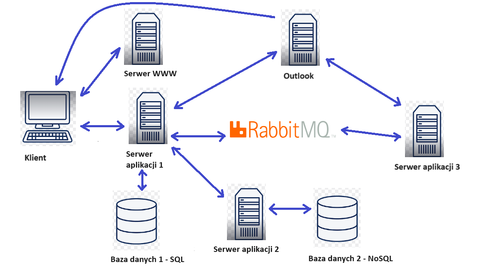

# Internet communicator

This repository contains web application named Connector, which I have done for course at university. It is a communicator, that allows to send text messages to friends. The main goal was that this app will alow for safe communication. To ensure that, I used JWT's to protect endpoints, passwords hashing to protect users passwords, sending mails to create 2FA, AES-256 to encrypt messages and RabbitMQ to safely queue messages. All components connects each other using TLS/SSL.     

Application architecture is shown below.

Technologies: 
- frontend: TypeScript + React
- backend: Python + FastApi
- SQL database: PostgreSQL
- NoSQL database: MongoDB
- Messages queue: RabbitMQ.
